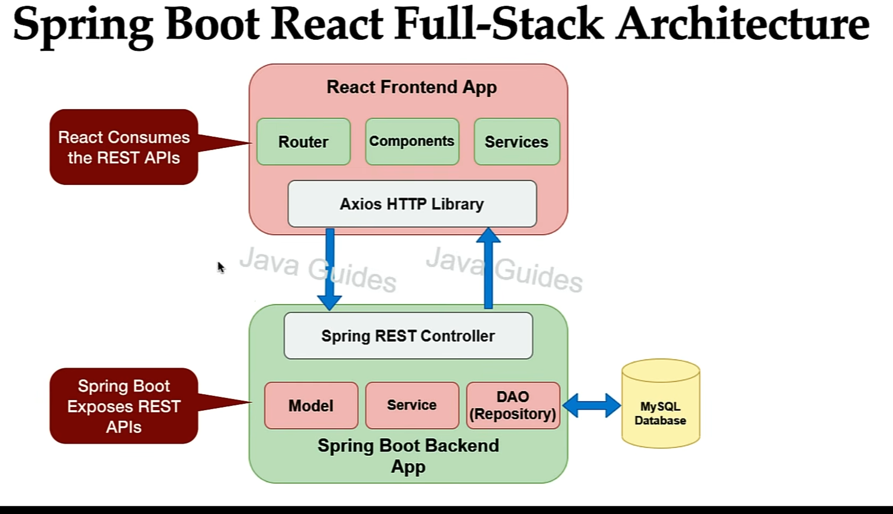

# LearningMatters-SbReact-EmployeeManagementModule
LearningMatters- Spring Boot React Full Stack - Employee Management Module

High Level Requirements.

1. CRUD Employees using Rest API.
2. Build FrontEnd for CRUD Employee

